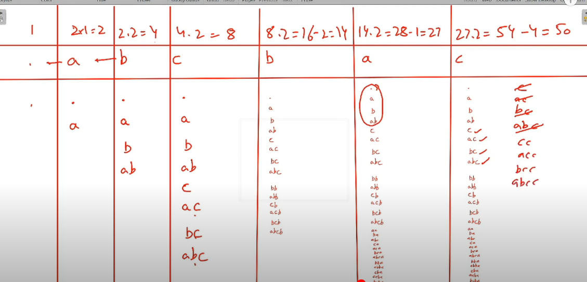

To find number of distinct subsequences of string, we need to rethink how we think about subsequences

say we have string = "abc"
. a b c (. means blank manje kuch nahi h)

- number of subsequnces till . = 1 (blank itself)
- number of subseq till a = 2 (how? ek to jo pehle se hai vo sab rahegi hi + sabke saath a interact karke utni hi alag banayegi so 2\*prev subsequences) = . and a
- num subse till b = 2\*2 = 4 (jo pehle se h vo + unki saath b interact karke banayega ) = . , a , b , ab
- num subse till c = 4\*2 = 8 = (. , a, b, ab, c, ac, bc, abc)

- to ab isme distinct ka kaha se laaye

- say string was extended till abcb
- we know number of subsequences till abc = 8 = (. , a, b, ab, c, ac, bc, abc)

- so we next b comes, naturally ans = 2\*8 = 16
  which will be (., a , b, ab , c, ac, bc , abc)+ (b,ab,bb,abb,cb,acb,bcb,abcb) jisme b and ab repeated so real ans = 14

- how to figure this out? we know b occured before and when it did, it interacted with dp[till a] = 2 strings and made new subsequences. so when this b interacts with those same 2 strings, it will create duplicates. so we need to substract number of subsequences that we available for previous b to interact with = number of subsequences till last occurence of b -1 index.

