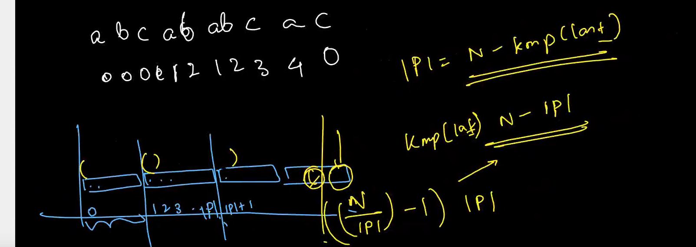

# Period of string

- smallest monomer which can be used to create the string s, by concatenation
- extendible period means vo monomer ko concatenate karke jo string aayi usme kuch last (complusory only at end) mai cut karke s mil gya to bhi chalega
- eg : s = "abcabcabc" has period = 3
- eg : s = "abcab" has period = 5 (entire length) m extendible period = 3 since if we use abc as monomer we get string "abcab|c" usme ye last ka c cut karke we get s
- method for finding both is same though

### Formula for extendible period = N - kmp(last index)

### Formula for period = N - kmp(last idx) OR N

- if N-kmp(last idx) divides N then it is the period, otherwise the string is not periodic and the ans is simply N
