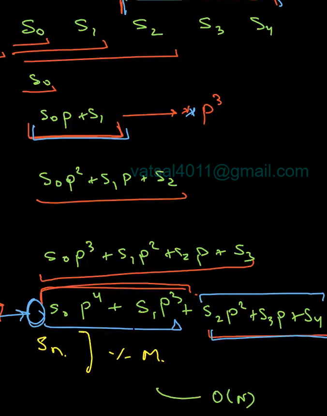

# Rolling Hash

- It helps to create a mapping from a string s to a number so that we can compare two strings in O(1) time complexity (since bas vo number compare karna hai and not each character of string).

- We will assign character a = 1, b = 2 ... till z = 26. Do note a = 1 and not a = 0 since when we compute hash value (by multiplying with some power of a prime number) then a ka kuch significance nahi rahega and aaa and aa both will map to 0 value.

Example Code of a hashing function :

```
ll quick_hash(string s,ll p,ll mod){
    ll ans = s[0]-'a'+1;
    for(int i=1;i<s.size();i++){
        ans = (ans*p + (s[i]-'a'+1));
    }
    //this is a general way how polynomials are created
    //say string S = S0 S1 S2.. SN-1 (ye sab characters hai)
    //ans will be = (S0*P^N-1 + S1*P*N-2 + .... SN) % MOD
    return ans;
}
```

While this code takes O(N) time, we can observe that the final hash value is being built incrementally for each prefix. So we can store the prefix hash value for each prefix. Using these values (with some manipulations) we can get hash value for any substrings as well.


